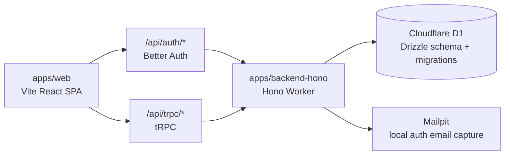

<!-- prettier-ignore -->
<div align="center">


# Gatekeeper

**Release decisions, evidenced.**

[](https://nodejs.org)
[](https://pnpm.io)
[](https://www.typescriptlang.org)
[](https://react.dev)
[](https://workers.cloudflare.com)

[Overview](#overview) | [Features](#features) | [Architecture](#architecture) | [Getting Started](#getting-started) | [Configuration](#configuration) | [Scripts](#scripts) | [Documentation](#documentation)

</div>

Gatekeeper helps organizations run release governance from one place. It brings Projects, reusable Controls, checklist foundations, exceptions, and audit evidence into a structured workflow so release decisions are based on evidence instead of memory, scattered spreadsheets, or private messages.

> [!NOTE]
> Gatekeeper is in active product development. The source currently implements authentication, organization membership, Projects, and Control Library workflows. The `docs/` directory describes the broader product direction and feature roadmap.

## Overview

Software teams often need to prove that a release is ready, but the work behind that decision is usually fragmented. Gatekeeper provides a shared operating model for release assurance:

- Define reusable governance requirements as Controls.
- Organize release work around organization-scoped Projects.
- Assign a Project Owner for accountability.
- Preserve archived Projects and Controls instead of deleting audit-relevant records.
- Govern Control publishing through approval policy and Control Publish Requests.
- Keep product APIs typed with tRPC while Better Auth owns authentication routes.

## Features

| Area               | What is available                                                                                                                                                 |
| ------------------ | ----------------------------------------------------------------------------------------------------------------------------------------------------------------- |
| Authentication     | Email/password sign-up and sign-in, required email verification, password reset, 7-day sessions, organization invitations, and Better Auth organization support.  |
| Organizations      | Organization creation, membership resolution, active organization switching, member listing, and organization-scoped app routes.                                  |
| Projects           | Create, list, view, edit, archive, and restore Projects with optional Project Owner assignment.                                                                   |
| Control Library    | Draft Controls, active and archived Controls, Control Codes, Control Versions, Release Impact, Accepted Evidence Types, and external standards mappings.          |
| Control publishing | Organization-level Control Approval Policy, Control Publish Requests, approvals, rejection, withdrawal, and publishing flows.                                     |
| UI foundation      | Vite React dashboard shell, auth pages, organization routes, project pages, control pages, and navigation placeholders for checklists, exceptions, and audit log. |

## Architecture

Gatekeeper is a pnpm and Turborepo workspace with a React SPA and a Cloudflare Worker backend.



| Path                | Purpose                                                                                                                             |
| ------------------- | ----------------------------------------------------------------------------------------------------------------------------------- |
| `apps/web`          | Vite React 19 SPA with React Router, TanStack Query, tRPC client, Better Auth client, Tailwind CSS, and shadcn-style UI primitives. |
| `apps/backend-hono` | Hono Cloudflare Worker with Better Auth, tRPC, Drizzle ORM, Cloudflare D1, and Zod validation.                                      |
| `docs`              | Business docs, feature specifications, and architecture decision records.                                                           |
| `CONTEXT-MAP.md`    | Root map for domain contexts, relationships, and canonical product language.                                                        |
| `compose.yaml`      | Local Mailpit service for auth and invitation emails.                                                                               |

## Getting Started

### Prerequisites

- [Git](https://git-scm.com/downloads)
- [Node.js 25.8.0](https://nodejs.org)
- [pnpm 10.33.0](https://pnpm.io/installation)
- [Docker](https://www.docker.com/get-started/) for local Mailpit email capture
- A Cloudflare account for remote D1 and deployment work; Wrangler is available through the backend package scripts

### Run Locally

1. Install dependencies.

```bash
pnpm install
```

2. Create local environment files.

```bash
cp apps/backend-hono/.env.example apps/backend-hono/.env
cp apps/web/.env.example apps/web/.env
```

3. Start Mailpit for local auth emails.

```bash
docker compose up -d mailpit
```

4. Apply local D1 migrations.

```bash
pnpm --filter backend-hono db:migrate
```

5. Start the web app and backend worker.

```bash
pnpm dev
```

| Service        | URL                     |
| -------------- | ----------------------- |
| Web app        | `http://localhost:5173` |
| Backend worker | `http://localhost:8787` |
| Mailpit UI     | `http://localhost:8025` |

> [!TIP]
> Verification, reset-password, and invitation emails are sent to Mailpit during local development. Open `http://localhost:8025` to continue those flows.

## Configuration

| File                               | Used by                                 | Notes                                                                                                                                                                 |
| ---------------------------------- | --------------------------------------- | --------------------------------------------------------------------------------------------------------------------------------------------------------------------- |
| `apps/web/.env`                    | Vite                                    | `VITE_BACKEND_URL` points the SPA to the Hono worker. The local default is `http://localhost:8787`.                                                                   |
| `apps/backend-hono/.env`           | Wrangler, Drizzle, and Cloudflare tools | Stores local Worker secrets/runtime values plus Cloudflare account, D1 database, and D1 token values for database tooling.                                            |
| `apps/backend-hono/wrangler.jsonc` | Cloudflare Worker                       | Defines the worker entry point, compatibility settings, and the D1 `DATABASE` binding. Update `database_id` for your Cloudflare D1 database before remote deployment. |

> [!NOTE]
> Wrangler loads local Worker variables from `apps/backend-hono/.env` when no `.dev.vars` file is present. If you already have a local `.dev.vars`, remove it or keep it aligned because Wrangler will prefer it over `.env`.

Important backend variables:

- `BETTER_AUTH_SECRET`
- `BETTER_AUTH_URL`
- `TRUSTED_ORIGINS`
- `CORS_ORIGIN`
- `MAIL_FROM_EMAIL`
- `MAIL_FROM_NAME`
- `MAILPIT_URL`
- `CLOUDFLARE_ACCOUNT_ID`
- `CLOUDFLARE_DATABASE_ID`
- `CLOUDFLARE_D1_TOKEN`

## Scripts

### Root Workspace

| Command             | Description                                            |
| ------------------- | ------------------------------------------------------ |
| `pnpm dev`          | Run all workspace development tasks through Turborepo. |
| `pnpm build`        | Build all apps.                                        |
| `pnpm lint`         | Run oxlint across the repository with warnings denied. |
| `pnpm lint:fix`     | Apply oxlint fixes.                                    |
| `pnpm format`       | Format the repository with oxfmt.                      |
| `pnpm format:check` | Check formatting without writing changes.              |
| `pnpm check-types`  | Typecheck all workspaces.                              |
| `pnpm test`         | Run all tests.                                         |

### Web App

| Command                         | Description                           |
| ------------------------------- | ------------------------------------- |
| `pnpm --filter web dev`         | Start Vite.                           |
| `pnpm --filter web build`       | Typecheck and build the SPA.          |
| `pnpm --filter web preview`     | Preview the production build locally. |
| `pnpm --filter web test`        | Run web tests with Vitest.            |
| `pnpm --filter web check-types` | Typecheck the web app.                |

### Backend Worker

| Command                                        | Description                                         |
| ---------------------------------------------- | --------------------------------------------------- |
| `pnpm --filter backend-hono dev`               | Start `wrangler dev`.                               |
| `pnpm --filter backend-hono build`             | Run a Cloudflare Worker deploy dry run into `dist`. |
| `pnpm --filter backend-hono deploy`            | Deploy the worker with Wrangler.                    |
| `pnpm --filter backend-hono db:generate`       | Generate Drizzle migrations from the schema.        |
| `pnpm --filter backend-hono db:migrate`        | Apply D1 migrations locally.                        |
| `pnpm --filter backend-hono db:migrate:remote` | Apply D1 migrations remotely.                       |
| `pnpm --filter backend-hono db:studio`         | Open Drizzle Studio.                                |
| `pnpm --filter backend-hono cf-typegen`        | Generate Cloudflare Worker binding types.           |
| `pnpm --filter backend-hono test`              | Run backend tests with the Cloudflare Vitest pool.  |

## Testing And Quality

CI runs separate web and backend workflows on pull requests and pushes to `master`.

| Check                 | Command                            |
| --------------------- | ---------------------------------- |
| Full lint             | `pnpm lint`                        |
| Full typecheck        | `pnpm check-types`                 |
| Full test suite       | `pnpm test`                        |
| Web build             | `pnpm --filter web build`          |
| Backend build dry run | `pnpm --filter backend-hono build` |

## Documentation

| Document                                                                           | What it covers                                                                                                                                                 |
| ---------------------------------------------------------------------------------- | -------------------------------------------------------------------------------------------------------------------------------------------------------------- |
| [`CONTEXT-MAP.md`](./CONTEXT-MAP.md)                                               | Root map for domain contexts, relationships, and canonical product language.                                                                                    |
| [`docs/README.md`](./docs/README.md)                                               | Index of business documents, feature specs, and ADRs.                                                                                                          |
| [`docs/01-problem-and-business-value.md`](./docs/01-problem-and-business-value.md) | Problem statement and business value.                                                                                                                          |
| [`docs/02-product-vision-and-scope.md`](./docs/02-product-vision-and-scope.md)     | Product vision, scope, and principles.                                                                                                                         |
| [`docs/adr`](./docs/adr)                                                           | Global architecture decisions; context-specific ADRs are linked from `CONTEXT-MAP.md`.                                                                          |
| [`docs/features`](./docs/features)                                                 | Feature-level specs for Projects, checklists, Control Library, evidence, exceptions, approvals, audit, MCP workflows, RBAC, notifications, and authentication. |

## Troubleshooting

> [!IMPORTANT]
> Keep `apps/web/.env`, `apps/backend-hono/.env`, and `apps/backend-hono/wrangler.jsonc` aligned. Auth cookies and tRPC calls require the web origin, backend URL, trusted origins, and CORS origin to agree.

| Symptom                                            | What to check                                                                            |
| -------------------------------------------------- | ---------------------------------------------------------------------------------------- |
| Auth emails do not arrive                          | Start Mailpit with `docker compose up -d mailpit` and open `http://localhost:8025`.      |
| Browser requests fail with CORS or missing session | Confirm `VITE_BACKEND_URL`, `TRUSTED_ORIGINS`, and `CORS_ORIGIN` match your local ports. |
| Database tables are missing locally                | Run `pnpm --filter backend-hono db:migrate`.                                             |
| Cloudflare binding types are stale                 | Run `pnpm --filter backend-hono cf-typegen` after changing `wrangler.jsonc`.             |
| Remote D1 commands fail                            | Fill `apps/backend-hono/.env` with Cloudflare account, database, and API token values.   |
